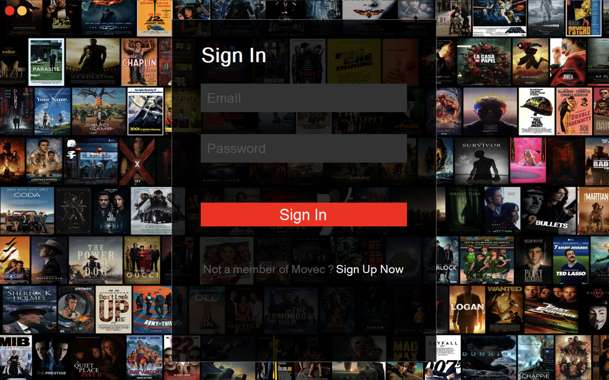
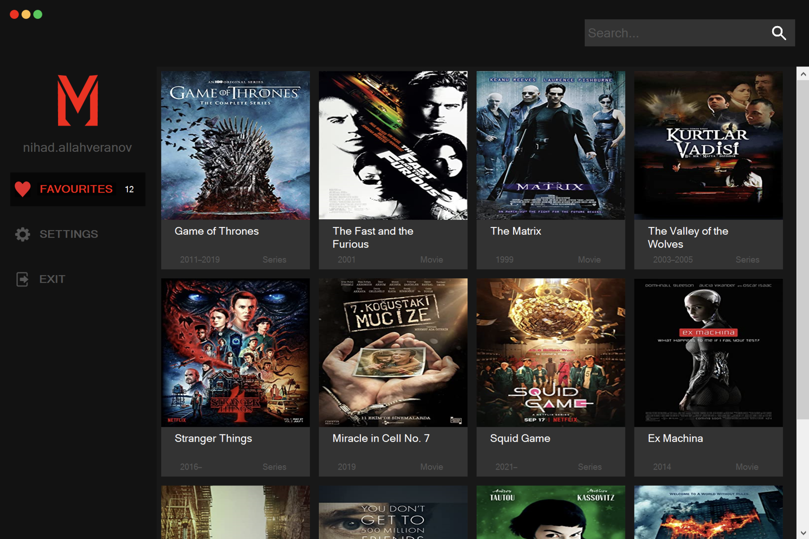
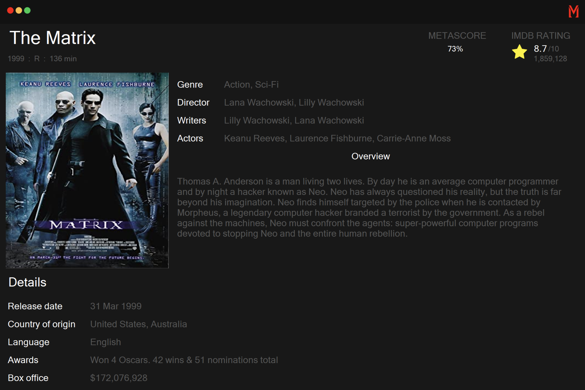

    

<h1
    align="center">
    Movec App
</h1>

<h2
    align="center">
    Unlimited Movies and Series
</h2>

<h4>
     
        This program is movie catalog software, developed by Nihad Allahveranov for course work.
     
     
    <a href="https://1drv.ms/u/s!AsfCuxlAU0_P0wgGP_JCSAoD16kH?e=pO1QTi">
        Course Work Docs
    </a>
     
     
        You can easily search for movies, get information about them, watch trailer, store your favorite movies in your favorites.
     
     
    

        Log In UI
        
    

        Cloud FireStore database (NoSQL) was used for real-time database.
     
     
        You can easily sign in and up anywhere with your email.
     
     
    

        Main Page UI
        
    

    

        <a href="https://rapidapi.com/rapidapi/api/movie-database-alternative/">
            API for Search & ID or Title
        </a>
         
         
        <a href="https://imdb-api.com/api/#Trailer-header">
            API for Trailer
        </a>
    

    

            Movie Information UI
        
    

</h4>
